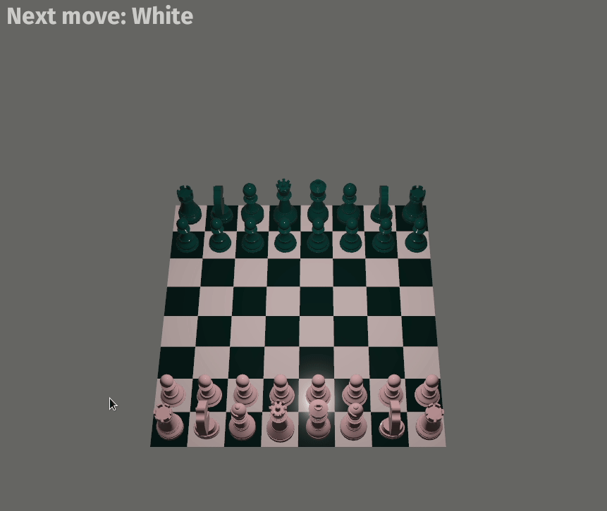

# Chess in Bevy

This is an implementation of the Chess game using the [Bevy] game engine, which
I follow from this [Tutorial] by @guimcaballero. The original tutorial uses
`bevy 0.4` and `bevy_mod_picking 0.3`, I migrated it to using `bevy 0.5` and
`bevy_mod_picking 0.4`. I also refactor a bit to save some boilerplate code.

## License

[MIT License](/LICENSE.md).

[Bevy]: https://github.com/bevyengine/bevy
[Tutorial]: https://caballerocoll.com/blog/bevy-chess-tutorial/
